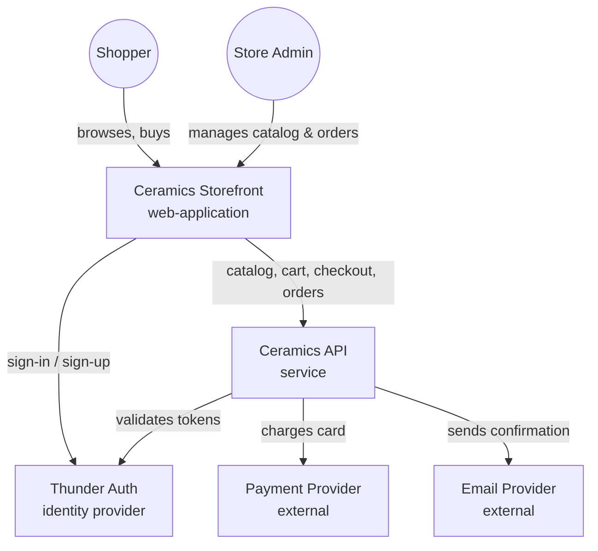
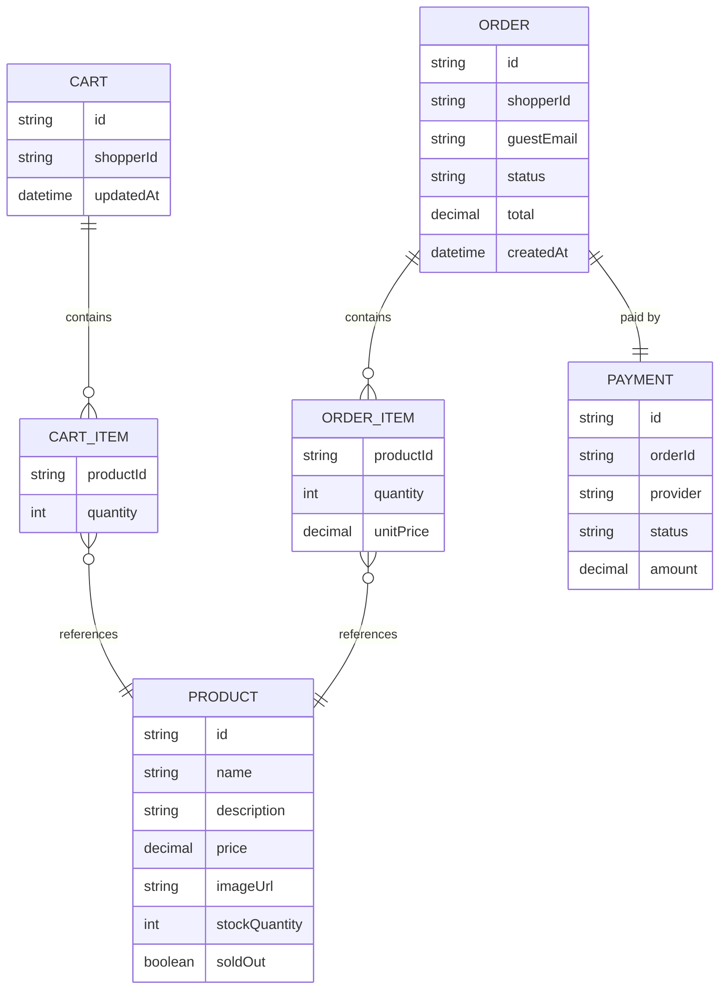
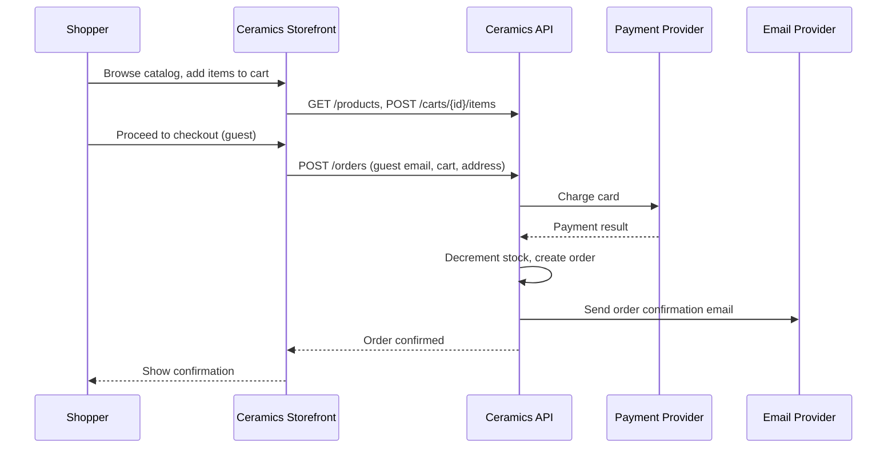
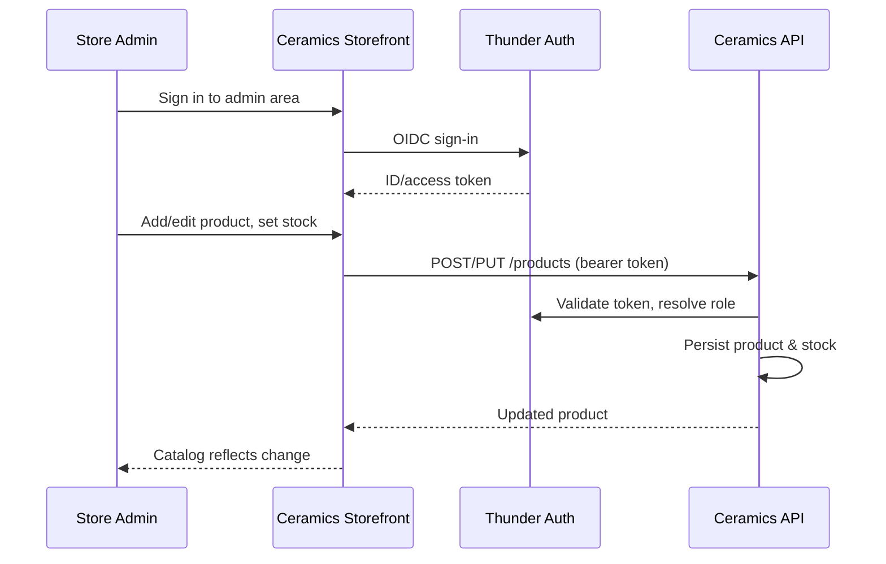
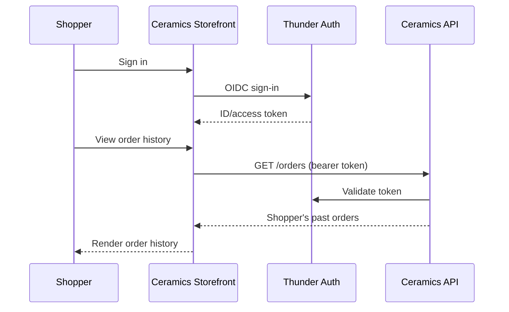

# Handmade Ceramics Store — Design

## Overview

A single-seller storefront: shoppers browse a product catalog, manage a cart, and check out — as a guest or signed in — with card payment and an email confirmation. The Store Admin (the shop owner) signs in to the same web application to manage the catalog, stock levels, and view incoming orders. The system is a React single-page application backed by one Ballerina API service and a Postgres database, with Thunder handling sign-in and third-party providers handling card payment and transactional email.

## Context (C1)

## Domain model (ER)

## Key flows

### Guest checkout

### Admin catalog management

### Signed-in shopper order history

